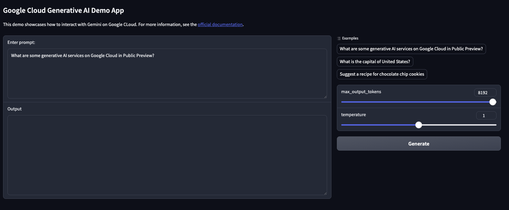

# Google Cloud GenAI Cloud Run App Demo

An example of how to deploy a GenAI app built with Python to Google Cloud Run.



## Getting Started

### Recommended - Cloud Shell

For an interactive tutorial within the Google Cloud Console and using [Cloud Shell](https://cloud.google.com/shell) click the button below:

[](https://console.cloud.google.com/bigquery/?cloudshell_git_repo=https://github.com/justinjm/google-cloud-genai-cloud-run-app-demo&cloudshell_tutorial=README.md)

### Alternative - Local Machine

Alternatively, can work from your local machine by 1) installing the [`gcloud` CLI](https://cloud.google.com/sdk/docs/install-sdk) and then 2) cloniog this repository via:

```sh
git clone https://github.com/justinjm/google-cloud-genai-cloud-run-app-demo \
  && cd google-cloud-genai-cloud-run-app-demo/
```

## Setup GCP Project

### Before you begin

The following steps are required, regardless of your environment:

1. [Select or create a Google Cloud project](https://console.cloud.google.com/cloud-resource-manager). When you first create an account, you get a $300 free credit towards your compute/storage costs.
2. [Make sure that billing is enabled for your project](https://cloud.google.com/billing/docs/how-to/modify-project).
3. Have the project ID handy and enter it in the next command below to authenticate.

## Setup App Code Files

This repository includes a sample app to deploy to Cloud Run. If you wish to use the demo app included in this repository, you can skip this step.

If you'd like to use this repo with your own app code, you'll need to:

1. Add your Python app files to the directory `build/app`
2. Update the `config.py` script with your project ID, region and model 
3. Update requirements.txt with the necessary python modules
4. Update the Dockerfile with any necessary changes
5. update the `args` file accordingly with your `APP_NAME` and any other modficiations you'd like to the arguements

### Authenticate

Authenticate with Google Cloud via the SDK, set the proper project and then set your [Application Default Credentails](https://cloud.google.com/docs/authentication/provide-credentials-adc) to ensure the proper credentials are used in the rest of the steps.

```sh
gcloud auth login
gcloud config set project <YOUR-PROJECT-ID>
gcloud auth application-default login
```

## Setup GCP Environment

### Enable APIs

Now that we are authenticated, we can enable the APIs we need by running the following:

```sh
gcloud services enable \
    discoveryengine.googleapis.com \
    cloudbuild.googleapis.com \
    artifactregistry.googleapis.com \
    run.googleapis.com 
```

## Build Image

Next, we build the image with our app that will be deployed to Cloud Run.

### Create Artifact Registry (docker repository)

Create an Artifact Registry (AR) repository (repo) to serve as our docker repository.

Running the code below will check if the repo exists first and create only if it does not exist.

```sh
sh 00_setup_gcp.sh
```

### Configure auth

```sh
gcloud auth configure-docker $REGION-docker.pkg.dev --quiet
```

### Build container iamge and deploy to cloud run

Build our container image in Cloud Build using the supplied Dockerfile. Once the image is finished building (~3-5mins), it will deploy to Cloud Run.

```sh
sh 01_build_deploy.sh
```

## Undeploy Cloud Run Service

To undeploy / delete the cloud run service, run the following:

```sh
source args

gcloud run services delete $CLOUD_RUN_SERVICE_NAME --region=$REGION
```

## References

* <https://github.com/GoogleCloudPlatform/generative-ai/blob/main/language/sample-apps/chat-gradio/app.py> - official repo with sample app
* [Build and deploy a Langchain app with a vector database | Wietse Venema's blog](https://wietsevenema.eu/build-and-deploy-a-langchain-app-with-a-vector-database/) - by Wietse Venema, Googler responsible for the NEXT 24' Demo
